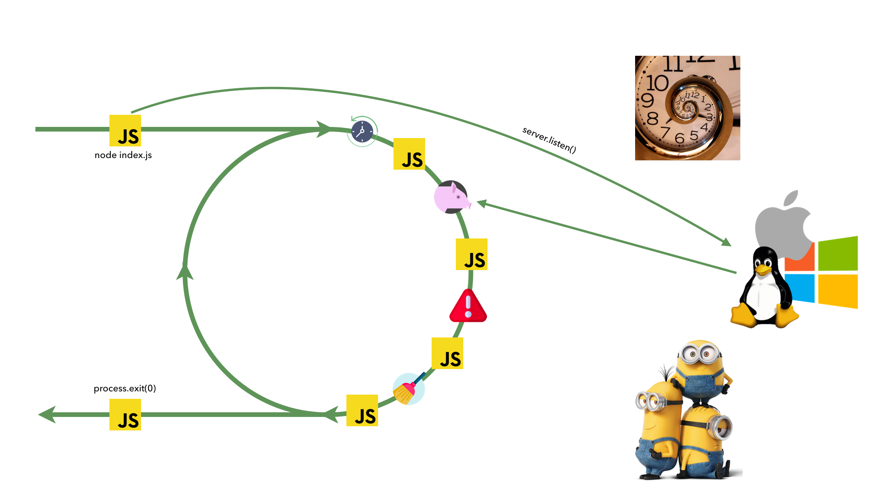
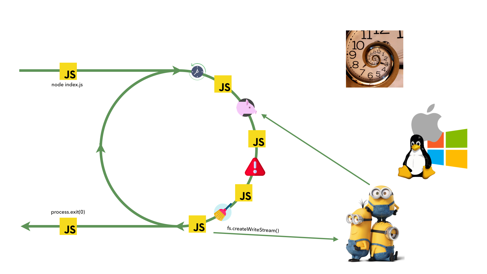
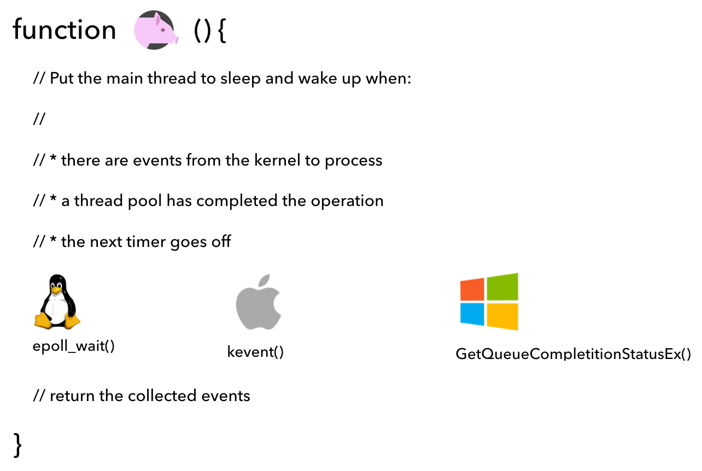
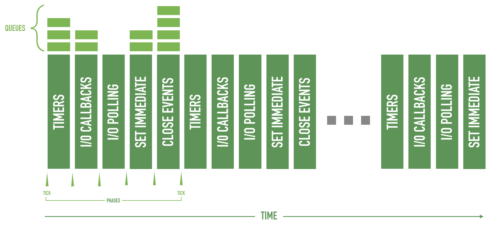
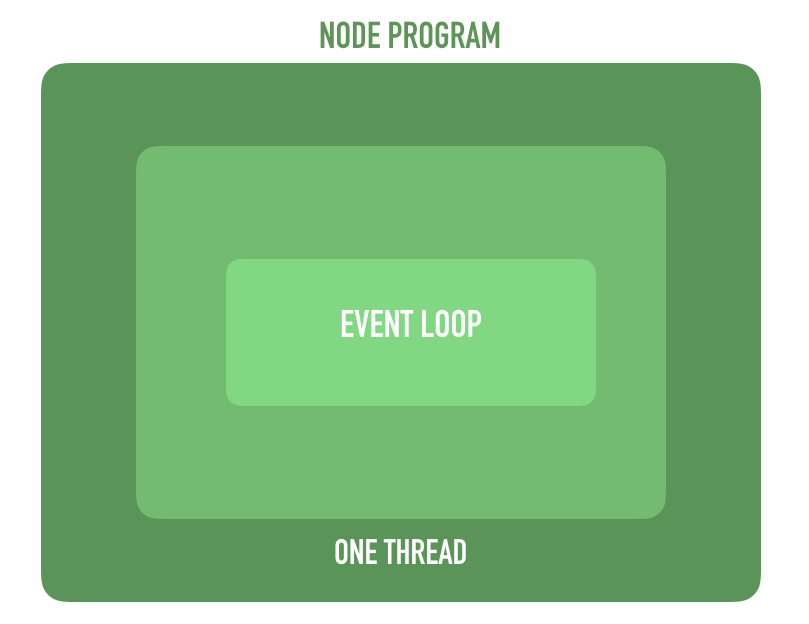

export { theme } from './config'
import { CodeSurferLayout, Code } from 'code-surfer'
import { Appear, Image } from 'mdx-deck'
import { Big, Center, BaseSlide, BigTitle, GreenSlide } from './config'
import {
  Invert,
  Split,
  SplitRight,
  Horizontal,
  FullScreenCode,
} from '@mdx-deck/layouts'

<Image src="images/1_new_york.jpg"
  style={{
    display: 'flex',
    justifyContent: 'center',
    alignItems: 'center',
    color: '#fff',
    flexDirection: 'column',
    fontSize: '4rem',
    fontWeight: 900
  }}
>


<BigTitle>INTRODUCTION</BigTitle>

</Image>

---

<GreenSlide>
  <SplitRight>
    <div style={{ padding: '2rem' }}>
      <h1>Table of contents</h1>
      <p>
        Node’s early beginning<br />
        Node.js philosophy<br />
        How it works?<br />
        The event loop<br />
        The recipe of Node.js<br />
        Installation<br />
        Hello, World!<br />
      </p>
    </div>
    
  </SplitRight>
</GreenSlide>

---
<BaseSlide>
  <h1>Node.js</h1>
  <Big>
    <p>
      <ul>
        <li>JavaScript runtime</li>
        <li>Mono-threaded</li>
        <li>Asynchronous</li>
        <li>With a large ecosystem (npm)</li>
      </ul>
    </p>
  </Big>
</BaseSlide>

---

<BaseSlide>
  <h1>Module counts</h1>
  <Center>
    
  </Center>
</BaseSlide>

---

<BaseSlide>
  <h1>Node js usage</h1>
  <Big>
    <p>
      <ul>
        <li>Web Servers</li>
        <li>IoT</li>
        <li>Front end tooling</li>
        <li>Scripting</li>
        <li>...</li>
      </ul>
    </p>
  </Big>
</BaseSlide>

---

<SplitRight>
  <div style={{ padding: '2rem' }}>
    <h1>Ryan Dahl</h1>
    <ul>
    <li>Created Node.js in 2009</li>
      <li>Debuted Node.js at JSConf EU 2009</li>
      <li>Initially Node.js development was sponsored by Joyent</li>
      <li>In January 2012, Ryan step away from project</li>
    </ul>
  </div>

  
</SplitRight>

---

<SplitRight>
  <div style={{ padding: '2rem' }}>
    <h1>Philosophy</h1>
    <p>
    "EVERY PLATFORM HAS ITS OWN PHILOSOPHY - A SET
OF PRINCIPLES AND GUIDELINES THAT ARE
GENERALLY ACCEPTED BY THE COMMUNITY, AN
IDEOLOGY OF DOING THINGS THAT INFLUENCES THE
EVOLUTION OF A PLATFORM, AND HOW APPLICATIONS
ARE DEVELOPED AND DESIGNED"
    </p>
  </div>

  
</SplitRight>

---

<BaseSlide>
  <h1>Small Modules</h1>
  <Big>
  <p>
    Node.js uses the concept of a module as a fundamental means to structure the code of a program
    <ul>
      <li>"Small is Beautiful"</li>
      <li>"Make each program do one think well"</li>
    </ul>
  </p>
  </Big>
</BaseSlide>

---

<BaseSlide>
  <h1>Small Modules</h1>
  <Big>
  <p>
    Besides the clear advantage in terms of reusability, a small module is also considered to be the following
    <ul>
      <li>Easier to understand and use</li>
      <li>Simpler to test and maintain</li>
    </ul>
  </p>
  </Big>
</BaseSlide>

---

<BaseSlide>
  <h1>SMALL SURFACE AREA</h1>
  <Big>
  <p>
    In addition to being small in size and scope, Node.js modules usually also have the characteristic of exposing a minimal set of functionalities
    <ul>
      <li>Expose only one piece of functionality</li>
      <li>Created to be used rather than extended</li>
    </ul>
  </p>
  </Big>
</BaseSlide>

---

<SplitRight>
  <div style={{ padding: '2rem' }}>
    <h1>From small modules to DRY principle</h1>
    <p>
    HAVING SMALLER AND MORE FOCUSED
MODULES EMPOWERS EVERYONE TO SHARE
OR REUSE EVEN THE SMALLEST PIECE OF
CODE; IT'S THE DON'T REPEAT YOURSELF (DRY)
PRINCIPLE APPLIED TO A WHOLE NEW LEVEL.
    </p>
  </div>

  
</SplitRight>

---

<SplitRight>
  <div style={{ padding: '2rem' }}>
    <h1>KISS</h1>
    <p>
    KEEP IT SIMPLE, STUPID
    </p>
  </div>

  
</SplitRight>

---

<Image src="images/how_works.png"
  style={{
    display: 'flex',
    justifyContent: 'center',
    alignItems: 'center',
    color: '#fff',
    flexDirection: 'column',
    fontSize: '4rem',
    fontWeight: 900
  }}
>
  Node.js
  <BigTitle>HOW IT WORKS?</BigTitle>
</Image>

---

<BaseSlide>
  <h1>I/O IS SLOW</h1>
  <Big>
    What makes NodeJS distinguished from any other programming platforms is how it handles I/O
  </Big>
  <div style={{ textAlign: 'center' }}>
    
  </div>
</BaseSlide>

---

<BaseSlide>
  <h1>Blocking I/O</h1>
  <Big>
    Multiple threads. One for each connection
  </Big>
  <div style={{ textAlign: 'center' }}>
    
  </div>
</BaseSlide>

---

<BaseSlide>
  <h1>NON Blocking I/O</h1>
  <Big>
    Single Thread and Event Demultiplexing
  </Big>
  <div style={{ textAlign: 'center' }}>
    
  </div>
</BaseSlide>

---

<Image src="images/familia.jpg"
  style={{
    display: 'flex',
    justifyContent: 'center',
    alignItems: 'center',
    color: '#fff',
    flexDirection: 'column',
    fontSize: '4rem',
    fontWeight: 900
  }}
>
  Node.js
  <BigTitle>INSIDE THE EVENT LOOP</BigTitle>
</Image>

---

<BaseSlide>
  <h1>Inside the event loop</h1>
  <div style={{ textAlign: 'center' }}>
    
  </div>
</BaseSlide>

---

<BaseSlide>
  <h1>Inside the event loop</h1>
  <div style={{ textAlign: 'center' }}>
    
  </div>
</BaseSlide>

---

<BaseSlide>
  <h1>Inside the event loop</h1>
  <div style={{ textAlign: 'center' }}>
    
  </div>
</BaseSlide>

---

<BaseSlide>
  <h1>Inside the event loop</h1>
  <div style={{ textAlign: 'center' }}>
    
  </div>
</BaseSlide>

---

<BaseSlide>
  <h1>Inside the event loop</h1>
  <div style={{ textAlign: 'center' }}>
    
  </div>
</BaseSlide>

---

<BaseSlide>
  <h1>Inside the event loop - Puork Function</h1>
  <div style={{ textAlign: 'center' }}>
    
  </div>
</BaseSlide>

---

<BaseSlide>
  <h1>Inside the event loop - JS Block</h1>
  <div style={{ textAlign: 'center' }}>
    
  </div>
</BaseSlide>

---

<BaseSlide>
  <h1>Understanding the phases of an event loop cycle</h1>
  <div style={{ textAlign: 'center' }}>
    
  </div>
</BaseSlide>

---

<BaseSlide>
  <h1>One Thread</h1>
  <p>
    There is only one thread that executes JavaScript code and this is the thread where the event loop is running.
  </p>
  <div style={{ textAlign: 'center' }}>
    
  </div>
</BaseSlide>

---

<Image src="images/recipe.png"
  style={{
    display: 'flex',
    justifyContent: 'center',
    alignItems: 'center',
    color: '#fff',
    flexDirection: 'column',
    fontSize: '4rem',
    fontWeight: 900
  }}
>
  Node.js
  <BigTitle>THE RECIPE</BigTitle>
</Image>

---

<BaseSlide>
  <h1>The non blocking i/o engine of node.js</h1>
  <Big>
  The Node.js core team created a C library called libuv, with the objective to make Node.js compatible with all the major platforms and normalize the non-blocking behavior of the different types of resource; libuv today represents the low- level I/O engine of Node.js
  </Big>
  <Center style={{ height: 'auto' }}>
  
  </Center>
</BaseSlide>

---

<BaseSlide>
  <Center>
    
  </Center>
</BaseSlide>

---

<BaseSlide>
  <h1>Userland program</h1>
  <div style={{ textAlign: 'center' }}>
    
  </div>
</BaseSlide>

---

<Image src="images/installation.png"
  style={{
    display: 'flex',
    justifyContent: 'center',
    alignItems: 'center',
    color: '#fff',
    flexDirection: 'column',
    fontSize: '4rem',
    fontWeight: 900
  }}
>
  Node.js
  <BigTitle>INSTALLATION</BigTitle>
</Image>

---

<BaseSlide style={{ padding: 0 }}>
  <Center>
    
  </Center>
</BaseSlide>

---

<BaseSlide>
  <h1>Node version manager - NVM</h1>
  <p>
    Node Version Manager (nvm) is a tool that allows you to manage multiple versions of Node.js on the same machine. Each version runs in its own isolated environment, so you can safely switch versions without affecting the whole system. It is the Node.js equivalent of Ruby’s rvm and rbenv.
  </p>
</BaseSlide>

---

  <CodeSurferLayout>

```makefile title="Install via Homebrew"
$ brew install nvm
```

```makefile title="Install Manually"
$ brew install nvm

$ curl https://raw.githubusercontent.com/creationix/nvm/v0.33.11/install.sh | bash
$ source ~/.bashrc # or ~/.zshrc or ~/.profile
```

```makefile title="Install latest stable Node.js"
$ brew install nvm

$ curl https://raw.githubusercontent.com/creationix/nvm/v0.33.11/install.sh | bash
$ source ~/.bashrc # or ~/.zshrc or ~/.profile

$ nvm install stable
$ nvm use stable
```

  </CodeSurferLayout>

---

<BaseSlide>
  <h1>First node.js application</h1>
  <Big>
    <ol>
      <li>Import required modules − We use the require directive to load Node.js modules.</li>
      <li>Create server − A server which will listen to client's requests similar to Apache HTTP Server.</li>
      <li>Read request and return response − The server created in an earlier step will read the HTTP request made by the client which can be a browser or a console and return the response.</li>
    </ol>
  </Big>
</BaseSlide>

---

<CodeSurferLayout>

<Code
  title="Import required modules"
  lang="js"
  focus="1:6"
  code={require("!!raw-loader!./codes/first-app.js").default}
/>

<Code
  title="Create server"
  lang="js"
  focus="8:8"
  code={require("!!raw-loader!./codes/first-app.js").default}
/>

<Code
  title="Read request and return response"
  lang="js"
  focus="8:12"
  code={require("!!raw-loader!./codes/first-app.js").default}
/>

<Code
  title="Start the server"
  lang="js"
  focus="14:16"
  code={require("!!raw-loader!./codes/first-app.js").default}
/>

```makefile title="Start from command line"
$ node ./first-app.js
Server running at 127.0.0.1:3000
```

```makefile title="Test"
$ curl 127.0.0.1:3000
{"sayHello":"Hello World"}
```

</CodeSurferLayout>

---

<Image src="images/callback_intro.png"
  style={{
    display: 'flex',
    justifyContent: 'center',
    alignItems: 'center',
    color: '#fff',
    flexDirection: 'column',
    fontSize: '4rem',
    fontWeight: 900
  }}
>
  Node.js essential pattern
  <BigTitle>CALLBACK PATTERN</BigTitle>
</Image>

---

<SplitRight>
  <div style={{ padding: '2rem' }}>
    <h1>What is a callback?</h1>
    <p>
    A callback is a function that is passed as an argument to another function and is invoked with the result when the operation completes. In functional programming, this way of propagating the result is called continuation-passing style (CPS)
    </p>
  </div>

  
</SplitRight>

---

<CodeSurferLayout>

<Code
  title="Q/A on Callbacks"
  lang="js"
  focus="1:9"
  code={require("!!raw-loader!./codes/synch-callback.js").default}
/>

```makefile
$ node index.js
before
Result: 3
after
```

</CodeSurferLayout>

---

<CodeSurferLayout>

<Code
  title="Q/A on Callbacks"
  lang="js"
  focus="1:9"
  code={require("!!raw-loader!./codes/asynch-callback.js").default}
/>

```makefile
$ node index.js
before
after
Result: 3
```

</CodeSurferLayout>

---

<CodeSurferLayout>

<Code
  title="Q/A on Callbacks"
  lang="js"
  focus="1:9"
  code={require("!!raw-loader!./codes/asynch-callback2.js").default}
/>

```makefile
$ node index.js
before
after
Result: 3
```

</CodeSurferLayout>

---

<CodeSurferLayout>

<Code
  title="Asynchronous passing style"
  lang="js"
  focus="3:5"
  code={require("!!raw-loader!./codes/asynch-callback.js").default}
/>

<Code
  title="Asynchronous passing style"
  lang="js"
  focus="3:5"
  code={require("!!raw-loader!./codes/asynch-callback2.js").default}
/>

</CodeSurferLayout>

---

<Image src="images/async1.png"
  style={{
    display: 'flex',
    justifyContent: 'center',
    alignItems: 'center',
    color: '#fff',
    flexDirection: 'column',
    fontSize: '4rem',
    fontWeight: 900
  }}
/>

---

<Image src="images/async2.png"
  style={{
    display: 'flex',
    justifyContent: 'center',
    alignItems: 'center',
    color: '#fff',
    flexDirection: 'column',
    fontSize: '4rem',
    fontWeight: 900
  }}
/>

---

<Image src="images/async3.png"
  style={{
    display: 'flex',
    justifyContent: 'center',
    alignItems: 'center',
    color: '#fff',
    flexDirection: 'column',
    fontSize: '4rem',
    fontWeight: 900
  }}
/>

---

<Image src="images/async4.png"
  style={{
    display: 'flex',
    justifyContent: 'center',
    alignItems: 'center',
    color: '#fff',
    flexDirection: 'column',
    fontSize: '4rem',
    fontWeight: 900
  }}
/>

---

<Image src="images/async5.png"
  style={{
    display: 'flex',
    justifyContent: 'center',
    alignItems: 'center',
    color: '#fff',
    flexDirection: 'column',
    fontSize: '4rem',
    fontWeight: 900
  }}
/>

---

<Image src="images/async6.png"
  style={{
    display: 'flex',
    justifyContent: 'center',
    alignItems: 'center',
    color: '#fff',
    flexDirection: 'column',
    fontSize: '4rem',
    fontWeight: 900
  }}
/>

---

<Image src="images/async7.png"
  style={{
    display: 'flex',
    justifyContent: 'center',
    alignItems: 'center',
    color: '#fff',
    flexDirection: 'column',
    fontSize: '4rem',
    fontWeight: 900
  }}
/>

---

<Image src="images/async8.png"
  style={{
    display: 'flex',
    justifyContent: 'center',
    alignItems: 'center',
    color: '#fff',
    flexDirection: 'column',
    fontSize: '4rem',
    fontWeight: 900
  }}
/>

---

<Image src="images/async9.png"
  style={{
    display: 'flex',
    justifyContent: 'center',
    alignItems: 'center',
    color: '#fff',
    flexDirection: 'column',
    fontSize: '4rem',
    fontWeight: 900
  }}
/>

---

<Image src="images/async10.png"
  style={{
    display: 'flex',
    justifyContent: 'center',
    alignItems: 'center',
    color: '#fff',
    flexDirection: 'column',
    fontSize: '4rem',
    fontWeight: 900
  }}
/>

---

<CodeSurferLayout>

```js title="Conventions - Callback come last"
fs.readFile(filename, [options], callback)
```

```js title="Conventions - Error come first"
fs.readFile('foo.txt', 'utf8', (err, data) => {
  if(err)
    handleError(err)
  else
    processData(data)
})
```

```js title="Propagating errors"
const fs = require('fs')

function readJSON(filename, callback) {
  fs.readFile(filename, 'utf8', (err, data) => {
    let parsed
    if(err)
      //propagate the error and exit the current function
      return callback(err)
    try {
      //parse the file contents
      parsed = JSON.parse(data)
    } catch(err) {
      //catch parsing errors
      return callback(err)
    }
    //no errors, propagate just the data
    callback(null, parsed)
  })
}
```
</CodeSurferLayout>

---

<Image src="images/gug.png"
  style={{
    display: 'flex',
    justifyContent: 'center',
    alignItems: 'center',
    color: '#fff',
    flexDirection: 'column',
    fontSize: '4rem',
    fontWeight: 900
  }}
>

Asynchrony
<BigTitle>Under the hood</BigTitle>

</Image>

---

<SplitRight>
  <div style={{ padding: '2rem' }}>
    <p>
    Whenever we want to use the result of a callback to make another asynchronous call, we need to nest callbacks.
Since I/O operations can result in errors, we need to handle errors for each callback before processing the success result.
This necessity to do error handling and having to embed callbacks makes the callback code difficult to read.
    </p>
  </div>

  
</SplitRight>

---

<CodeSurferLayout>

```js
function spider(url, callback) {
  const filename = utilities.urlToFilename(url);
  fs.exists(filename, exists => {
    if(!exists) {
      console.log('Downloading');
      request(url, (err, response, body) => {
        if(err) {
          callback(err);
        } else {
          mkdirp(path.dirname(filename), err => {
            if(err) {
              callback(err);
            } else {
              fs.writeFile(filename, body, err => {
                if(err) {
                  callback(err);
                } else {
                  callback(null, filename, true);
                }
              });
            }
          });
        }
      });
    } else {
      callback(null, filename, false);
    }
  });
}
```

</CodeSurferLayout>

---

<BaseSlide>
  <Center>
    
    <h2>Promises</h2>
  </Center>
</BaseSlide>

---

<BaseSlide>
  <Center>
    
    <h2>It’s a relationship between now and a later</h2>
  </Center>
</BaseSlide>

---

<BaseSlide>
  <Center>
    
  </Center>
</BaseSlide>

---

<BaseSlide>
  <Center>
    
  </Center>
</BaseSlide>

---

<BaseSlide>
  <Center>
    
  </Center>
</BaseSlide>

---

<CodeSurferLayout>

<Code
  title="Converting callback based method"
  lang="js"
  focus="5:13"
  code={require("!!raw-loader!./codes/promise.js").default}
/>

<Code
  title="Converting callback based method"
  lang="js"
  focus="15:18"
  code={require("!!raw-loader!./codes/promise.js").default}
/>

</CodeSurferLayout>

---

<BaseSlide>
  <h1>Static methods</h1>
  <p>
    <ul>
      <li><strong>Promise.resolve(obj)</strong>: This creates a new promise from a thenable or a value.</li>
      <li><strong>Promise.reject(err)</strong>: This creates a promise that rejects with err as the reason.</li>
      <li><strong>Promise.all(iterable)</strong>: This creates a promise that fulfills with an iterable of fulfillment values when every item in the iterable object fulfills, and rejects with the first rejection reason if any item rejects. Each item in the iterable object can be a promise, a generic thenable, or a value.</li>
      <li><strong>Promise.race(iterable)</strong>: This returns a promise that resolves or rejects as soon as one of the promises in the iterable resolves or rejects, with the value or reason from that promise. </li>
    </ul>
  </p>
</BaseSlide>

---

<CodeSurferLayout>

```js title="ASYNC/AWAIT"
let promise = new Promise((resolve, reject) => {
  setTimeout(() => resolve("done!"), 1000)
})

async function f() {
  try {
    let result = await promise // wait till the Promise resolves
    alert(result) // "done!"
  } catch (e) {
    console.error(e)
  }
}
```

</CodeSurferLayout>

---

<BaseSlide>
  <Center>
    
    <h2>Common errors</h2>
  </Center>
</BaseSlide>

---

<CodeSurferLayout>

```js title="Nested promises"
loadSomething().then(something => {
  loadAnotherThing().then(another => {
    doSomething(something, another)
  }).catch(e => console.error(e))
}).catch(e => console.error(e))
```

```js title="Nested promises"
Promise.all([
     loadSomething(),
     loadAnotherThing()
  ])
  .then(([something, another]) => {
    doSomething(something, another)
  })
  .catch(e => console.error(e))
```

</CodeSurferLayout>

---

<CodeSurferLayout>

```js title="Missing catch"
const fs = require('fs').promises

fs.stat('non-existing-file.txt')
  .then(stat => console.log(stat))
```

```js title="Missing catch"
const fs = require('fs').promises

fs.stat('non-existing-file.txt')
  .then(stat => console.log(stat))
  .catch(err => console.log(err))
```

</CodeSurferLayout>

---

<CodeSurferLayout>

```js title="Mixing Promise and async/await"
const mainMethod = () => {
  return new Promise(async function (resolve, reject) {
    try {
      const data1 = await someMethod()
      const data2 = await someOtherMethod()

      someCallbackMethod(data1, data2, (err, finalData) => {
        if (err) {
          return reject(err)
        }

        resolve(finalData)
      })
    } catch (e) {
      reject(e)
    }
  })
}
```

```js title="Mixing Promise and async/await"
const somePromiseMethod = (data1, data2) => {
  return new Promise((resolve, reject) => {
    someCallbackMethod(data1, data2, (err, finalData) => {
      if (err) {
        return reject(err)
      }

      resolve(finalData)
    })
  })
}

async function mainMethod() {
  try {
    const data1 = await someMethod()
    const data2 = await someOtherMethod()
    return somePromiseMethod(data1, data2)
  } catch (e) {
    console.error(e)
  }
}
```

</CodeSurferLayout>

---

<CodeSurferLayout>

```js title="CALLBACK - PROMISE - ASYNC/AWAIT"
getData(a => {
  getMoreData(a, b => {
    getMoreData(b, c => {
      getMoreData(c, d => {
        getMoreData(d, e => {
          console.log(e)
        })
      })
    })
  })
})
```

```js title="CALLBACK - PROMISE - ASYNC/AWAIT"
getData()
  .then(a => getMoreData(a))
  .then(b => getMoreData(b))
  .then(c => getMoreData(c))
  .then(d => getMoreData(d))
  .then(e => console.log(e))
```

```js title="CALLBACK - PROMISE - ASYNC/AWAIT"
(async = () => {
  const a = await getData()
  const b = await getMoreData(b)
  const c = await getMoreData(c)
  const d = await getMoreData(d)
  const e = await getMoreData(e)
  console.log(e)
})
```

</CodeSurferLayout>