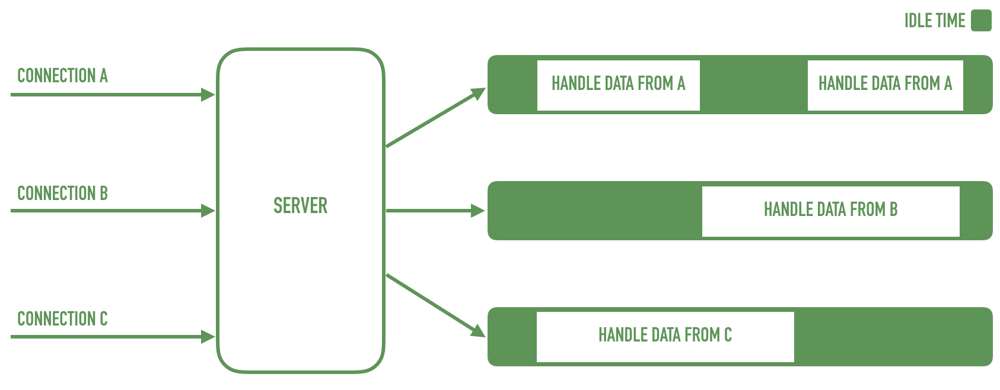
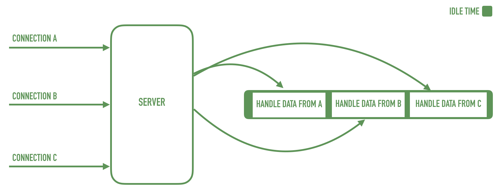
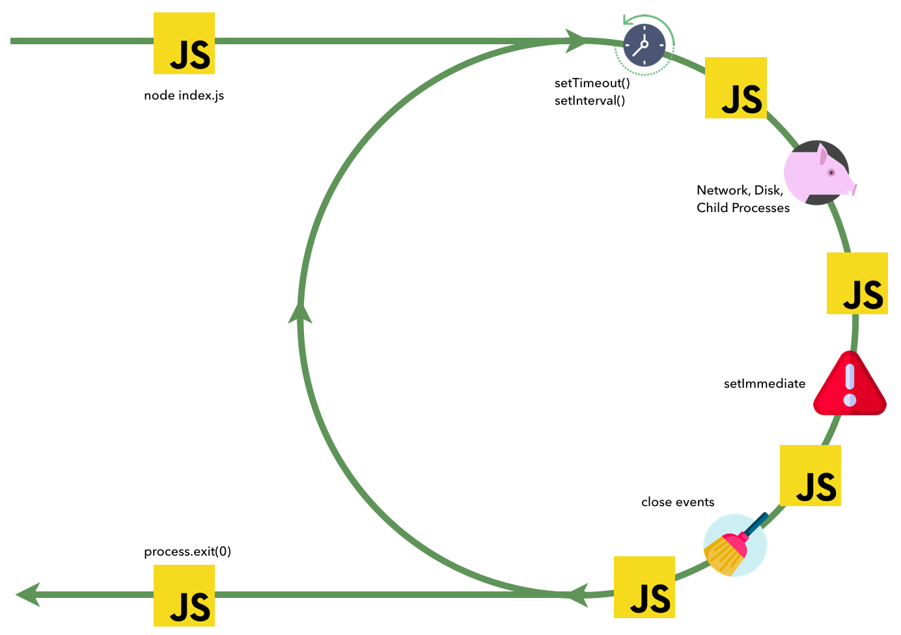

export { theme } from './config'
import { CodeSurferLayout, Code } from 'code-surfer'
import { Appear, Image } from 'mdx-deck'
import { Big, Center, BaseSlide, BigTitle, GreenSlide } from './config'
import {
  Invert,
  Split,
  SplitRight,
  Horizontal,
  FullScreenCode,
} from '@mdx-deck/layouts'

<Image src="images/1_new_york.jpg"
  style={{
    display: 'flex',
    justifyContent: 'center',
    alignItems: 'center',
    color: '#fff',
    flexDirection: 'column',
    fontSize: '4rem',
    fontWeight: 900
  }}
>

INTRODUCTION

</Image>

---

<GreenSlide>
  <SplitRight>
    

      <h1>Table of contents</h1>
      

        Node’s early beginning 
        Node.js philosophy 
        How it works? 
        The event loop 
        The recipe of Node.js 
        Installation 
        Hello, World! 
      

    

    
  </SplitRight>
</GreenSlide>

---
<BaseSlide>
  <h1>Node.js</h1>
  <Big>
    

      <ul>
        <li>JavaScript runtime</li>
        <li>Mono-threaded</li>
        <li>Asynchronous</li>
        <li>With a large ecosystem (npm)</li>
      </ul>
    

  </Big>
</BaseSlide>

---

<BaseSlide>
  <h1>Module counts</h1>
  

    
  

</BaseSlide>

---

<BaseSlide>
  <h1>Node js usage</h1>
  <Big>
    

      <ul>
        <li>Web Servers</li>
        <li>IoT</li>
        <li>Front end tooling</li>
        <li>Scripting</li>
        <li>...</li>
      </ul>
    

  </Big>
</BaseSlide>

---

<SplitRight>
  

    <h1>Ryan Dahl</h1>
    <ul>
    <li>Created Node.js in 2009</li>
      <li>Debuted Node.js at JSConf EU 2009</li>
      <li>Initially Node.js development was sponsored by Joyent</li>
      <li>In January 2012, Ryan step away from project</li>
    </ul>
  

  
</SplitRight>

---

<SplitRight>
  

    <h1>Philosophy</h1>
    

    "EVERY PLATFORM HAS ITS OWN PHILOSOPHY - A SET
OF PRINCIPLES AND GUIDELINES THAT ARE
GENERALLY ACCEPTED BY THE COMMUNITY, AN
IDEOLOGY OF DOING THINGS THAT INFLUENCES THE
EVOLUTION OF A PLATFORM, AND HOW APPLICATIONS
ARE DEVELOPED AND DESIGNED"
    

  

  
</SplitRight>

---

<BaseSlide>
  <h1>Small Modules</h1>
  <Big>
  

    Node.js uses the concept of a module as a fundamental means to structure the code of a program
    <ul>
      <li>"Small is Beautiful"</li>
      <li>"Make each program do one think well"</li>
    </ul>
  

  </Big>
</BaseSlide>

---

<BaseSlide>
  <h1>Small Modules</h1>
  <Big>
  

    Besides the clear advantage in terms of reusability, a small module is also considered to be the following
    <ul>
      <li>Easier to understand and use</li>
      <li>Simpler to test and maintain</li>
    </ul>
  

  </Big>
</BaseSlide>

---

<BaseSlide>
  <h1>SMALL SURFACE AREA</h1>
  <Big>
  

    In addition to being small in size and scope, Node.js modules usually also have the characteristic of exposing a minimal set of functionalities
    <ul>
      <li>Expose only one piece of functionality</li>
      <li>Created to be used rather than extended</li>
    </ul>
  

  </Big>
</BaseSlide>

---

<SplitRight>
  

    <h1>From small modules to DRY principle</h1>
    

    HAVING SMALLER AND MORE FOCUSED
MODULES EMPOWERS EVERYONE TO SHARE
OR REUSE EVEN THE SMALLEST PIECE OF
CODE; IT'S THE DON'T REPEAT YOURSELF (DRY)
PRINCIPLE APPLIED TO A WHOLE NEW LEVEL.
    

  

  
</SplitRight>

---

<SplitRight>
  

    <h1>KISS</h1>
    

    KEEP IT SIMPLE, STUPID
    

  

  
</SplitRight>

---

<Image src="images/how_works.png"
  style={{
    display: 'flex',
    justifyContent: 'center',
    alignItems: 'center',
    color: '#fff',
    flexDirection: 'column',
    fontSize: '4rem',
    fontWeight: 900
  }}
>
  Node.js
  <BigTitle>HOW IT WORKS?</BigTitle>
</Image>

---

<BaseSlide>
  <h1>I/O IS SLOW</h1>
  <Big>
    What makes NodeJS distinguished from any other programming platforms is how it handles I/O
  </Big>
  

    
  

</BaseSlide>

---

<BaseSlide>
  <h1>Blocking I/O</h1>
  <Big>
    Multiple threads. One for each connection
  </Big>
  

    
  

</BaseSlide>

---

<BaseSlide>
  <h1>NON Blocking I/O</h1>
  <Big>
    Single Thread and Event Demultiplexing
  </Big>
  

    
  

</BaseSlide>

---

<Image src="images/familia.jpg"
  style={{
    display: 'flex',
    justifyContent: 'center',
    alignItems: 'center',
    color: '#fff',
    flexDirection: 'column',
    fontSize: '4rem',
    fontWeight: 900
  }}
>
  Node.js
  <BigTitle>INSIDE THE EVENT LOOP</BigTitle>
</Image>

---

<BaseSlide>
  <h1>Inside the event loop</h1>
  

    
  

</BaseSlide>

---

<BaseSlide>
  <h1>Inside the event loop</h1>
  

    
  

</BaseSlide>

---

<BaseSlide>
  <h1>Inside the event loop</h1>
  

    
  

</BaseSlide>

---

<BaseSlide>
  <h1>Inside the event loop</h1>
  

    
  

</BaseSlide>

---

<BaseSlide>
  <h1>Inside the event loop</h1>
  

    
  

</BaseSlide>

---

<BaseSlide>
  <h1>Inside the event loop - Puork Function</h1>
  

    
  

</BaseSlide>

---

<BaseSlide>
  <h1>Inside the event loop - JS Block</h1>
  

    
  

</BaseSlide>

---

<BaseSlide>
  <h1>Understanding the phases of an event loop cycle</h1>
  

    
  

</BaseSlide>

---

<BaseSlide>
  <h1>One Thread</h1>
  

    There is only one thread that executes JavaScript code and this is the thread where the event loop is running.
  

  

    
  

</BaseSlide>

---

<Image src="images/recipe.png"
  style={{
    display: 'flex',
    justifyContent: 'center',
    alignItems: 'center',
    color: '#fff',
    flexDirection: 'column',
    fontSize: '4rem',
    fontWeight: 900
  }}
>
  Node.js
  <BigTitle>THE RECIPE</BigTitle>
</Image>

---

<BaseSlide>
  

    
  

</BaseSlide>

---

<BaseSlide>
  <h1>Userland program</h1>
  

    
  

</BaseSlide>

---

<Image src="images/installation.png"
  style={{
    display: 'flex',
    justifyContent: 'center',
    alignItems: 'center',
    color: '#fff',
    flexDirection: 'column',
    fontSize: '4rem',
    fontWeight: 900
  }}
>
  Node.js
  <BigTitle>INSTALLATION</BigTitle>
</Image>