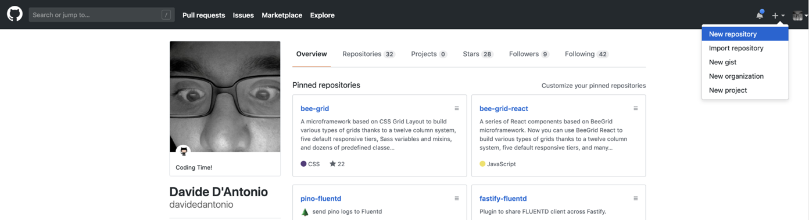
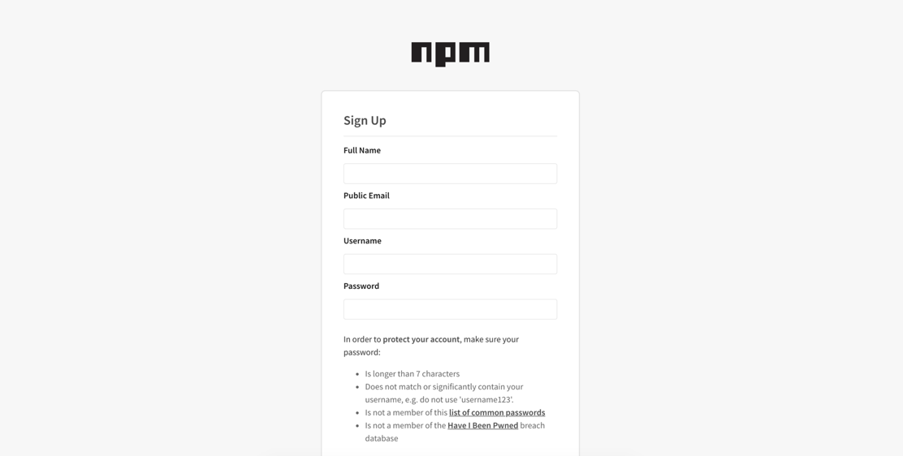
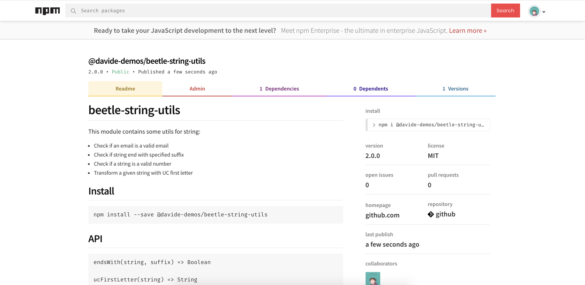

export { theme } from './config'
import { CodeSurferLayout, Code } from 'code-surfer'
import { Appear, Image } from 'mdx-deck'
import { Big, Center, BaseSlide, BigTitle, GreenSlide } from './config'
import {
  Invert,
  Split,
  SplitRight,
  Horizontal,
  FullScreenCode,
} from '@mdx-deck/layouts'

<Image src="images/intro.png"
  style={{
    display: 'flex',
    justifyContent: 'center',
    alignItems: 'center',
    color: '#fff',
    flexDirection: 'column',
    fontSize: '4rem',
    fontWeight: 900
  }}
>


<BigTitle>PART 2</BigTitle>

</Image>

---

<GreenSlide>
  <SplitRight>
    <div style={{ padding: '2rem' }}>
      <h1>Table of contents</h1>
      <p>
        Write a module<br />
        Working with I/O<br />
        Working with streams<br />
        Web Protocol<br />
      </p>
    </div>
    
  </SplitRight>
</GreenSlide>

---

<BaseSlide>
  <h1>Writing a module</h1>
    <Big>
      In idiomatic Node, the module is the fundamental unit of logic. Any typical application or system consists of generic code and application code.
As a best practice, generic shareable code should be held in discrete modules, which can be composed together at the application level with minimal amounts of domain-specific logic.
    </Big>
</BaseSlide>

---

<BaseSlide>
  <h1>Writing a module</h1>
Contrary to popular belief, npm is not an acronym for Node Package Manager; in fact, it stands for npm is Not An Acronym, which is why it's not called NINAA.
  <div style={{ textAlign: 'center' }}>
    
  </div>
</BaseSlide>

---

<BaseSlide>
  <h1>Ho to do it</h1>
  <p>
    Let’s say that we want to create a module that contain various type of checks. We call it beetle-string-utils. This module must do the following things:
    <ul>
      <li>Check if a string is a valid email</li>
      <li>Check if a string is a valid Number</li>
      <li>Make first letter of a string uppercase</li>
      <li>Check if string end with given string</li>
    </ul>
  </p>
</BaseSlide>

---

<CodeSurferLayout>

```makefile title="npm init"
$ mkdir beetle-string-utils
$ cd beetle-string-utils
$ npm init
```

```makefile title="package.json"
{
  "name": "beetle-string-utils",
  "version": "1.0.0",
  "description": "A wonderful module for beetle nodejs course",
  "main": "index.js",
  "scripts": {
    "test": "echo \"Error: no test specified\" && exit 1"
  },
  "keywords": [
    "utils",
    "string"
  ],
  "author": "Davide D'Antonio <davide.dantonio@webeetle.com>",
  "license": "MIT"
}
```

</CodeSurferLayout>

---

<BaseSlide>
  <h1>Ho to do it</h1>
  <p>Sometimes additional metadata can be available after we've created a module. A typical scenario can arise when we initialize our module as a Git repository and add a remote endpoint after creating the module. To demonstrate, we'll create a GitHub repository for our module</p>

  <div style={{ textAlign: 'center' }}>
    
  </div>
  <p>We'll specify the name as beetle-string-utils and click on Create Repository.</p>
</BaseSlide>

---

<CodeSurferLayout>

```makefile title="Reinitializing"
$ git init
$ git remote add origin https://github.com/<username>/beetle-string-utils.git
$ git fetch
$ git pull origin master
$ git add .
$ git commit -m 'initial commit’
$ git push origin master
```

```makefile title="The magic part"
$ npm init
```

</CodeSurferLayout>

---

<BaseSlide>
  <h1>Versioning</h1>
  <p>The npm tool supplies other functionality to help with module creation and management workflow.
For instance, the npm version command can allow us to manage our module's version number according to SemVer semantics. </p>

  <a href="" target="_blank">https://semver.org/</a>
</BaseSlide>

---

<CodeSurferLayout>

```makefile title="If we were to a fix a bug, we would want to increase the PATCH number"
$ npm version patch
```

```makefile title="If we added a new backwards-compatible functionality"
$ npm version minor
```

```makefile title="For a major version bump"
$ npm version major
```

```makefile title="Install dependencies"
npm install --save is-number
npm install --save-dev standard
```

```makefile title="Our package.json"
  "dependencies": {
    "is-number": "^7.0.0"
  },
  "devDependencies": {
    "standard": "^12.0.1"
  }
```

```js title="Writing our code"
const isValidEmail = string => {
  ...
}

const isValidNumber = string => {
  ...
}

const ucFirstLetter = string => {
  ...
}

const endWith = string => {
  ...
}
```

```makefile title="Tap tap test"
npm install --save-dev tap
```

```js title="file test.js"
const test = require('tap').test
const beeStringUtils = require('./')

test('check if is valid email', t => {
  t.plan(5)
  t.equal(beeStringUtils.isValidEmail('davide.dantonio@webeetle.com'), true)
  t.equal(beeStringUtils.isValidEmail('davide.dantonio@webeetle'), false)
  t.equal(beeStringUtils.isValidEmail('davide.webeetle'), false)
  t.equal(beeStringUtils.isValidEmail('davide.webeetle@gmail'), false)
  t.equal(beeStringUtils.isValidEmail('davide.webeetle@gmail.com'), true)
})
```

```makefile title="Add this line in package.json"
"test": "standard && tap test.js"
```

```makefile title="Run the test"
$ npm run test
```

```markdown title="Write a good README.md"
# beetle-string-utils

This module contains some utils for string:

- Check if an email is a valid email
- Check if string end with specified suffix
- Check if a string is a valid number
- Transform a given string with UC first letter

## Install

…

## API
…

## Examples
…

## LICENSE

Licensed under [MIT](./LICENSE)
```

</CodeSurferLayout>

---

<BaseSlide>
  <h1>Publishing a module</h1>
  <p>If we don't have an npm account, we'll need to head over to http://npmjs.org/signup and get an account.</p>

  <div style={{ textAlign: 'center' }}>
    
  </div>
</BaseSlide>

---

<CodeSurferLayout>

```makefile title="login in npm"
$ npm login
```

```makefile title="publish the module"
$ npm publish --access=public
```

</CodeSurferLayout>

---

<BaseSlide>
  <h1>Publishing a module</h1>

  <div style={{ textAlign: 'center' }}>
    
  </div>
</BaseSlide>

---

<CodeSurferLayout>

```makefile title="Install the module"
$ mkdir my-app
$ cd my-app
$ npm init
$ npm install @davide-demos/beetle-string-utils
```

</CodeSurferLayout>

---

<Image src="images/intro_io.png"
  style={{
    display: 'flex',
    justifyContent: 'center',
    alignItems: 'center',
    color: '#fff',
    flexDirection: 'column',
    fontSize: '4rem',
    fontWeight: 900
  }}
>
  Node.js
  <BigTitle>WORKING WITH I/O</BigTitle>
</Image>

---

<BaseSlide>
  <h1>Interfacing with standard I/O</h1>
  <p>Standard I/O relates to the predefined input, output, and error data channels that connect a process to a shell terminal, commonly known as STDIN, STDOUT, and STDERR. Of course, these can be redirected and piped to other programs for further processing, storage, and so on.
    Node provides access to standard I/O on the global process object. </p><p>
    In this recipe, we're going to take some input, and use it to form some data which we'll send to STDOUT, while simultaneously logging to STDERR.
  </p>
</BaseSlide>

---

<CodeSurferLayout>

  <Code
    title="An example to start"
    lang="js"
    focus="3:6"
    code={require("!!raw-loader!./codes/exampleToStart.js").default}
  />
</CodeSurferLayout>

---

<BaseSlide>
  <h1>Interfacing with standard I/O</h1>
  <p>Standard I/O relates to the predefined input, output, and error data channels that connect a process to a shell terminal, commonly known as STDIN, STDOUT, and STDERR. Of course, these can be redirected and piped to other programs for further processing, storage, and so on.
    Node provides access to standard I/O on the global process object. </p><p>
    In this recipe, we're going to take some input, and use it to form some data which we'll send to STDOUT, while simultaneously logging to STDERR.
  </p>
</BaseSlide>

---

<CodeSurferLayout>

<Code
  title="Read file - Import the required modules"
  lang="js"
  focus="3:4"
  code={require("!!raw-loader!./codes/readFile.js").default}
/>

<Code
  title="Read file - use fs.readFile"
  lang="js"
  focus="6:13"
  code={require("!!raw-loader!./codes/readFile.js").default}
/>

<Code
  title="Read file Sync"
  lang="js"
  focus="7:14"
  code={require("!!raw-loader!./codes/readFileSync.js").default}
/>

<Code
  title="Read command line arguments"
  lang="js"
  focus="1:20"
  code={require("!!raw-loader!./codes/commandLineArg.js").default}
/>

<Code
  title="Create a CSV file"
  lang="js"
  focus="1:28"
  code={require("!!raw-loader!./codes/csv.js").default}
/>

<Code
  title="Check file existence"
  lang="js"
  focus="5:17"
  code={require("!!raw-loader!./codes/checkFileExist.js").default}
/>

<Code
  title="Create a file"
  lang="js"
  focus="1:25"
  code={require("!!raw-loader!./codes/createFile.js").default}
/>

<Code
  title="Watching files"
  lang="js"
  focus="1:27"
  code={require("!!raw-loader!./codes/watchingFiles.js").default}
/>

</CodeSurferLayout>

---

<Image src="images/intro_io.png"
  style={{
    display: 'flex',
    justifyContent: 'center',
    alignItems: 'center',
    color: '#fff',
    flexDirection: 'column',
    fontSize: '4rem',
    fontWeight: 900
  }}
>
  Node.js
  <BigTitle>WORKING WITH STREAMS</BigTitle>
</Image>

---

<GreenSlide>
  <SplitRight>
    <div style={{ padding: '2rem' }}>
      <p>Streams are one of the best features in Node. They have been a big part of the ecosystem since the early days of Node and today thousands of modules exists on npm that help us compose all kinds of great stream-based apps. They allow us to work with large volumes of data in environments with limited resources.</p>
    </div>
    
  </SplitRight>
</GreenSlide>

---

<BaseSlide>
  <h1>Processing BIG data</h1>
  <p>
    Let's dive right into it by looking at a classic Node problem: counting all Node modules available on npm. The npm registry exposes an HTTP endpoint where we can get the entire contents of the npm registry content as JSON
  </p>

  <pre>
    <strong>$ curl https://skimdb.npmjs.com/registry/_changes?include_docs=true</strong>
  </pre>

  <p>
    This will print a new line delimited JSON stream of all modules. The JSON stream returned by the registry contains a JSON object for each module stored on npm followed by a new line character.
  </p>
</BaseSlide>

---

<CodeSurferLayout>

<Code
  lang="js"
  focus="8:15"
  code={require("!!raw-loader!./codes/stream-1.js").default}
/>

<Code
  lang="js"
  focus="6:12"
  code={require("!!raw-loader!./codes/stream-2.js").default}
/>

</CodeSurferLayout>

---

<BaseSlide>
  <h1>Processing BIG data</h1>
  <p>
    <ul>
      <li>In our case, we use a readable stream (as provided by the fs module) to read our source file a chunk at a time. Since our file is bigger than the maximum size per chunk (16 KB), and many chunck are read.</li>
      <li>The data event is therefore only emitted once, and then the end event is emitted.</li>
      <li>This data processing approach can scale potentially infinitely because the amount of memory used by the process stays constant.</li>
    </ul>
  </p>
</BaseSlide>

---

<BaseSlide>
  <h1>Types of streams</h1>
  <ul>
    <li><strong>Readable Stream</strong>: an example of a readable stream could be a stream that reads data from a file stored on disk</li>
    <li><strong>Writable Stream</strong>: an example of a writable stream could be a stream that writes data to a file stored on disk.</li>
    <li><strong>Duplex Stream</strong>: an example of a duplex stream could be a TCP network stream that both allows us to read data from the network and write data back at the same time.</li>
    <li><strong>Transform Stream</strong>: an example of a transform stream could be a GZIP stream that compresses the input data written to it</li>
  </ul>
</BaseSlide>

---

<BaseSlide>
  <h1>Understand Stream events - 1</h1>
  <ul>
    <li><strong>data</strong>: Emitted when new data is read from a readable stream. The data is provided as the first argument to the event handler. Beware that unlike other event handlers, attaching a data listener has side effects. When the first data listener is attached, our stream will be unpaused. We should never emit data ourselves. Instead, we should always use the push function. </li>
    <li><strong>end</strong>: Emitted when a readable stream has no more data available and all the available data has been read. We should never emit end ourselves; instead, we should pass null to push to signify the end of the data. </li>
    <li><strong>finish</strong>: Emitted when a writable stream has been ended and all pending writes have been completed. Similar to the aforementioned events, we should never emit finish ourselves. Use end() to trigger finish manually and pipe a readable stream to it. </li>
  </ul>
</BaseSlide>

---

<BaseSlide>
  <h1>Understand Stream events - 2</h1>
  <ul>
    <li><strong>close</strong>: Loosely defined in the stream docs, close is usually emitted when the stream is fully closed. Contrary to end and finish, a stream is not guaranteed to emit this event. It is fully up to the implementer to do this.</li>
    <li><strong>error</strong>: Emitted when a stream has experienced an error. This to be followed by a close event although, again, there are no guarantees that this will happen. </li>
    <li><strong>pause</strong>: Emitted when a readable stream has been paused. Pausing will happen when either backpressure occurs or if the pause method is explicitly called. For most use cases, you can just ignore this event, although it is useful to listen for, for debugging purposes sometimes. See the There's more section of the Decoupling I/O recipe for an example of backpressure and pause usage. </li>
  </ul>
</BaseSlide>

---

<BaseSlide>
  <h1>Understand Stream events - 3</h1>
  <ul>
    <li><strong>resume</strong>: Emitted when a readable stream goes from being paused to being resumed again. This will happen when the writable stream you are piping to has been drained or if resume has been explicitly called. See the There's more section of the Decoupling I/O recipe for an example of resume usage. </li>
  </ul>
</BaseSlide>

---

<BaseSlide>
  <h1>Async iterator and Streams</h1>
  <p>Node.js 10+ comes with support for async iterators. If you are happy to use an experimental feature, they are a simple, idiomatic way of keeping back pressure while working with asynchronous streams</p>

      const fs = require("fs")
      const input = fs.createReadStream("in-file.txt", "utf8")
      let inserts = 0

      for async (const data of input) {
        await insert(data)

        inserts++
      }
</BaseSlide>

---

<CodeSurferLayout>
  <Code
    lang="js"
    focus="6:12"
    code={require("!!raw-loader!./codes/async-streams.js").default}
  />
</CodeSurferLayout>

---

<Image src="images/pedrera.png"
  style={{
    display: 'flex',
    justifyContent: 'center',
    alignItems: 'center',
    color: '#fff',
    flexDirection: 'column',
    fontSize: '4rem',
    fontWeight: 900
  }}
>
  Node.js
  <BigTitle>WEB PROTOCOLS</BigTitle>
</Image>

---

<GreenSlide>
  <SplitRight>
    <div style={{ padding: '2rem' }}>
      <p>One of the great qualities of Node is the simplicity it provides around low-level system operations.
Unlike template-centric languages such as PHP or ASP, we have fine grain controlled over the behavior we want without sacrificing easy content control.
With Node we can create the server, customize it, and deliver content all at the code level.</p>
    </div>
    
  </SplitRight>
</GreenSlide>

---

<BaseSlide>
  <h1>Create an HTTP Server</h1>
  <p>
    HTTP is the most prolific protocol in the application layer of the internet protocol suite. Node comes bundled with the core http module which provides both client and server capabilities.
  </p>
  <p>We're going to create an HTTP server from scratch.</p>
</BaseSlide>

---

<CodeSurferLayout>
  <Code
    title="We require http module and define some some constants"
    lang="js"
    focus="1:6"
    code={require("!!raw-loader!./codes/httpServer.js").default}
  />

  <Code
    title="Create and http server"
    lang="js"
    focus="8:13"
    code={require("!!raw-loader!./codes/httpServer.js").default}
  />

  <Code
    title="Define users function"
    lang="js"
    focus="15:17"
    code={require("!!raw-loader!./codes/httpServer.js").default}
  />

  <Code
    title="and the index function"
    lang="js"
    focus="19:21"
    code={require("!!raw-loader!./codes/httpServer.js").default}
  />

  <Code
    title="if request method !== GET we return an error"
    lang="js"
    focus="23:26"
    code={require("!!raw-loader!./codes/httpServer.js").default}
  />

  <Code
    title="Start the server"
    lang="js"
    focus="29:29"
    code={require("!!raw-loader!./codes/httpServer.js").default}
  />

</CodeSurferLayout>

---

<BaseSlide>
  <h1>Create an HTTP Server...receiving POST data</h1>
  <p>If we want to be able to receive POST data, we have to instruct our server on how to accept and handle a POST request.</p>
  <p>In a language where I/O blocking is the primary runtime behavior, accessing POST body data would be as straightforward as accessing a property.</p>
  <p>For instance, in PHP we could access our POST values with $_POST['fieldname']; the execution thread would block until an array value was filled.</p>
  <p>Contrariwise, Node provides a low level interaction with the asynchronous flow of HTTP data allowing us to interface with the incoming message body as a stream, leaving it entirely up to the developer to turn that stream into usable data.</p>
</BaseSlide>

---

<CodeSurferLayout>
  <Code
    title="Require all the necessary"
    lang="js"
    focus="1:5"
    code={require("!!raw-loader!./codes/httpServerPost.js").default}
  />

  <Code
    title="The GET method render the form"
    lang="js"
    focus="7:12"
    code={require("!!raw-loader!./codes/httpServerPost.js").default}
  />

  <Code
    title="The POST method get the form data"
    lang="js"
    focus="14:41"
    code={require("!!raw-loader!./codes/httpServerPost.js").default}
  />

  <Code
    title="and then start the server"
    lang="js"
    focus="43:53"
    code={require("!!raw-loader!./codes/httpServerPost.js").default}
  />

</CodeSurferLayout>

---

<Image src="images/intro.png"
  style={{
    display: 'flex',
    justifyContent: 'center',
    alignItems: 'center',
    color: '#fff',
    flexDirection: 'column',
    fontSize: '4rem',
    fontWeight: 900
  }}
>

<BigTitle>Grazie</BigTitle>
<small>@davidedantonio</small>
</Image>