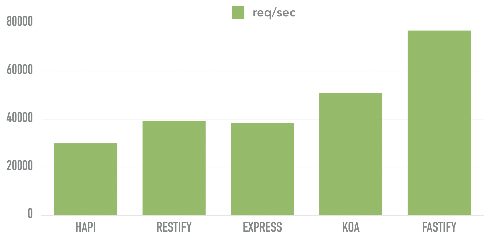
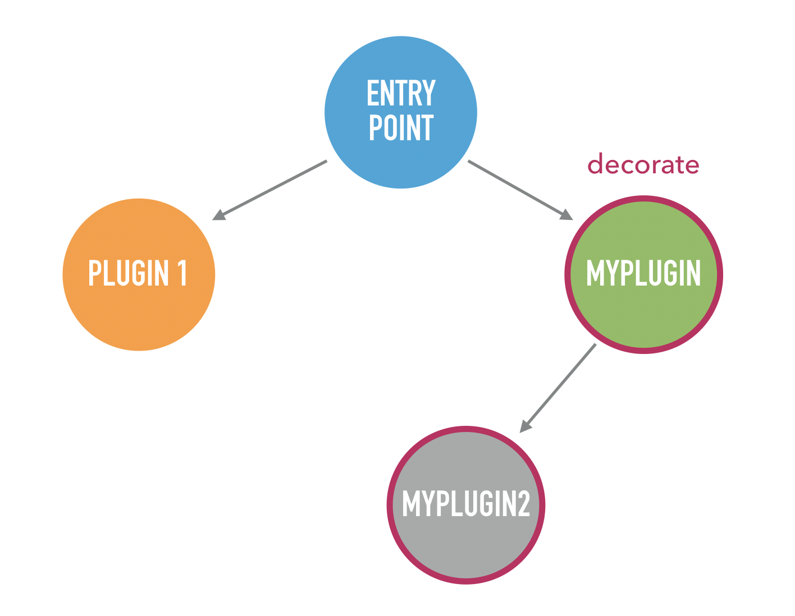
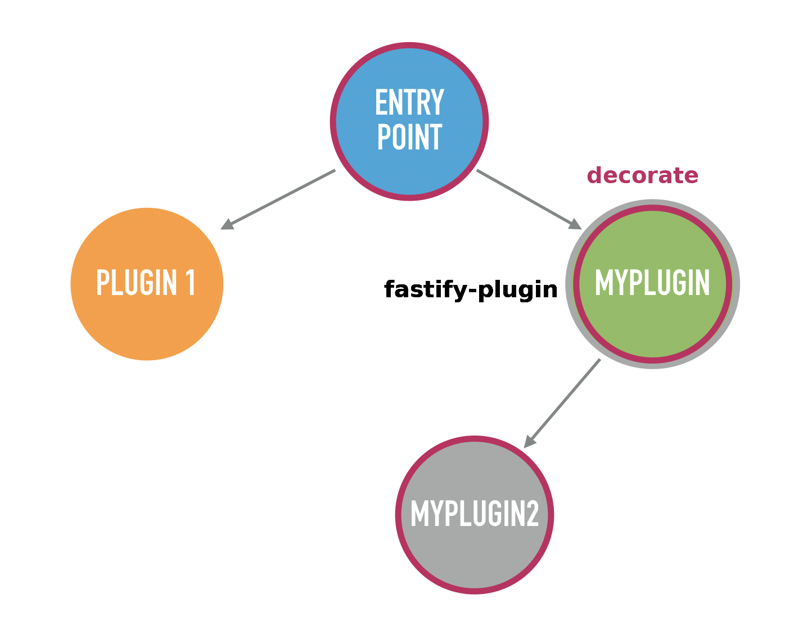
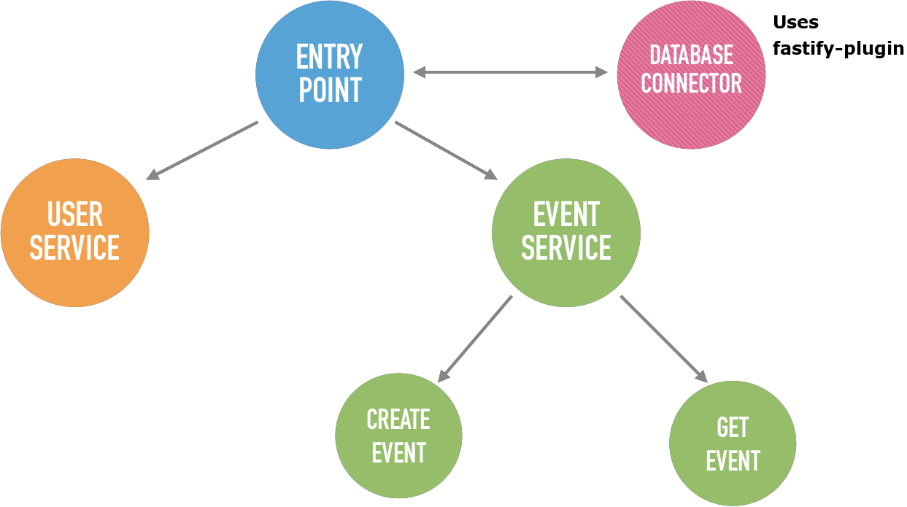
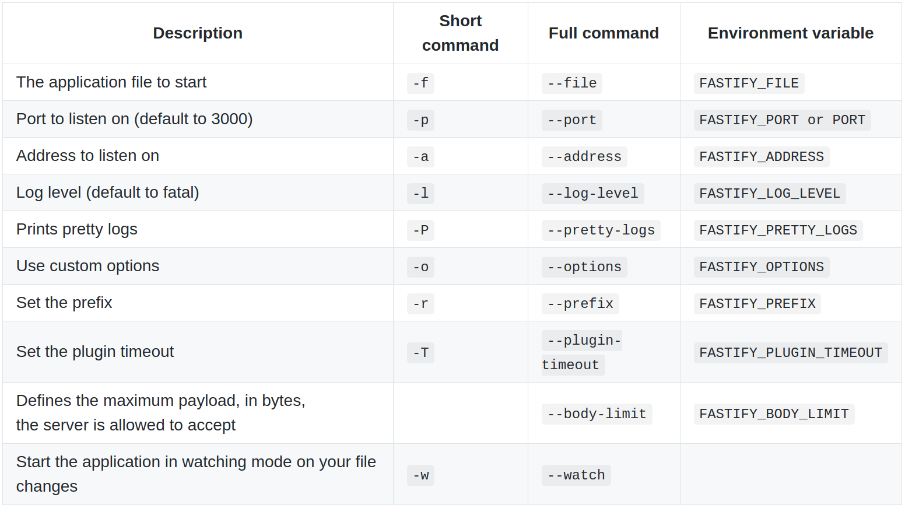

export { theme } from './config'
import {
  CodeSurferLayout,
  CodeSurferColumnLayout,
  Code
} from "code-surfer";
import {
  Invert,
  Split,
  SplitRight,
  Horizontal,
  FullScreenCode,
} from '@mdx-deck/layouts';
import { Appear, Image } from 'mdx-deck';
import { CenteredImages, BaseSlide, BigFont, ReadSlide, BigTitle } from './config'

<Image
  src="images/fastify.png"
  style={{
    display: 'flex',
    justifyContent: 'center',
    alignItems: 'center',
    color: '#fff',
    flexDirection: 'column',
    fontSize: '4rem',
    fontWeight: 900
  }}
>

</Image>

---

<SplitRight>


## Matteo Collina
Technical Director @NearForm

</SplitRight>

---

<SplitRight>


## Thomas della Vedova
Software Architect @elastic

</SplitRight>

---

<BaseSlide>
  <h1>Core Team</h1>
  <CenteredImages>
    <div className="avatar">
      
      <h6>Matteo Collina</h6>
    </div>
    <div className="avatar">
      
      <h6>Thomas Della Vedova</h6>
    </div>
    <div className="avatar">
      
      <h6>Tommaso Allevo</h6>
    </div>
    <div className="avatar">
      
      <h6>Ethan Arrowood</h6>
    </div>
    <div className="avatar">
      
      <h6>Cemre Mengu</h6>
    </div>
    <div className="avatar">
      
      <h6>Dustin Deus</h6>
    </div>
    <div className="avatar">
      
      <h6>Luciano Mammino</h6>
    </div>
    <div className="avatar">
      
      <h6>Evan Shortiss</h6>
    </div>
    <div className="avatar">
      
      <h6>Manuel Spigolon</h6>
    </div>
    <div className="avatar">
      
      <h6>James Sumners</h6>
    </div>
    <div className="avatar">
      
      <h6>Nathan Woltman</h6>
    </div>
  </CenteredImages>
</BaseSlide>

---

<BigFont>
  <h1>2000+</h1>
  <span className="subtitle">COMMITS</span>
</BigFont>

---

<BigFont>
  <h1>120+</h1>
  <span className="subtitle">RELEASES</span>
</BigFont>

---

<BigFont>
  <h1>180+</h1>
  <span className="subtitle">COLLABORATORS</span>
</BigFont>

---

<BigFont>
  <h1>110+</h1>
  <span className="subtitle">PLUGINS</span>
</BigFont>

---

<BigFont>
  <h1>Why Fastify?</h1>
</BigFont>

---

<BigFont>
  
</BigFont>

---

<BigFont>
  <code>fast-json-stringify</code>
</BigFont>

---
<CodeSurferLayout>

```js subtitle="2x faster than JSON.stringify()"
const fastJson = require('fast-json-stringify')

const stringify = fastJson({
  title: 'Example Schema',
  type: 'object',
  properties: {
    firstName: {
      type: 'string'
    },
    lastName: {
      type: 'string'
    },
    age: {
      description: 'Age in years',
      type: 'integer'
    }
  }
})
```

```js subtitle="Its performance advantage shrinks as your payload grows"
console.log(stringify({
  firstName: "Davide",
  lastName: "D'Antonio",
  age: 35
}))
```

</CodeSurferLayout>

---

<BigFont>
  <code>find-my-way</code>
</BigFont>

---

<CodeSurferLayout>

```js subtitle="A crazy fast HTTP router. Used by Netflix"
const http = require('http')
const router = require('find-my-way')()

router.on('GET', '/', (req, res, params) => {
  res.end('{"message":"hello world"}')
})

const server = http.createServer((req, res) => {
  router.lookup(req, res)
})
```

</CodeSurferLayout>

---

<BigFont>
  <span className="subtitle">Extendible via </span>
  <span className="colored">plugins</span>
</BigFont>

---

<CodeSurferLayout>

```js
fastify.register(
  require('my-plugin'),
  { options }
)
```

</CodeSurferLayout>

---

<CodeSurferLayout>

```js subtitle="Plugins must expose a single function with the following signature"
module.exports = function (fastify, options, next) {}
```

</CodeSurferLayout>

---

<BaseSlide>
  <code>module.exports = function (fastify, options, next) {}</code>
  <ul>
    <li><strong>fastify</strong>: the encapsulated fastify instance</li>
    <li><strong>options</strong>: the plugin options</li>
    <li><strong>next</strong>: is the function that will be called when the plugin has been correctly loaded</li>
  </ul>
</BaseSlide>

---

<CodeSurferLayout>

```js subtitle="async await is supported"
function myPlugin (fastify, opts, next) {
  // add another plugin
  fastify.register (...)

  // add an Hook
  fastify.addHook(...)

  // decorate fastify instance
  fastify.decorate(...)

  // add routes
  fastify.route(...)

  next()
}

module.exports = myPlugin
```

</CodeSurferLayout>

---

<BigFont>
  
</BigFont>

---

<BigFont>
  <code>fastify-plugin</code>
</BigFont>

---

<CodeSurferLayout>

```js subtitle="How to use fastify-plugin to expose plugin to the parent"
const fp = require('fastify-plugin')
const myPlugin2 = require('myPlugin2')

function myPlugin (fastify, opts, next) {
  fastify.decorate('myPlugin2', myPlugin2)
  next()
}

module.exports = fp(myPlugin)
```

</CodeSurferLayout>

---

<BigFont>
  
</BigFont>

---

<BigFont>
  
</BigFont>

---

<CodeSurferLayout>

```js title="Encapsulation is the keystone of fastify" subtitle="For example, allows us to have different logs levels for each plugin"
const fastify = require('fastify')()

fastify.register(require('./api/v1'), {
  prefix: '/v1',
  logLevel: 'error'
})

fastify.register(require('./api/v2'), {
  prefix: '/v2',
  logLevel: 'debug'
})
```

</CodeSurferLayout>

---

<BigFont>
  
  <h2>Pino</h2>
</BigFont>

---

<CodeSurferLayout>

```js title="Logging is disabled by default" subtitle="you can enable it by passing {logger: true} or {logger: { level: 'info' }}"
const fastify = require('fastify')({
  logger: true
})

fastify.get('/', options, function (request, reply) {
  request.log.info('Some info about the current request')
  reply.send({ hello: 'world' })
})

```

```js subtitle="If you want to specify a file destination"
const fastify = require('fastify')({
  logger: {
    level: 'info',
    file: '/path/to/file' // will use pino.destination()
  }
})

fastify.get('/', options, function (request, reply) {
  request.log.info('Some info about the current request')
  reply.send({ hello: 'world' })
})
```

</CodeSurferLayout>

---

<CodeSurferLayout>

```js subtitle="You can specify a log level"
fastify.log.trace('Trace level log')
fastify.log.debug('Debug level log')
fastify.log.info('Info level log')
fastify.log.warn('Warning level log')
fastify.log.error('Error level log')
fastify.log.fatal('Fatal level log')
```

</CodeSurferLayout>

---

<BigFont>
  <h1>Hooks</h1>
</BigFont>

---

<ReadSlide>
  <h1>Request/Response Hooks</h1>
  <p>
    By using the hooks you can interact directly inside the lifecycle of Fastify.<br />
    There are seven different Hooks that you can use (in order of execution):
  </p>
  <p>
    <ul>
    <li><strong>onRequest</strong></li>
    <li><strong>preParsing</strong></li>
    <li><strong>preValidation</strong></li>
    <li><strong>preHandler</strong></li>
    <li><strong>preSerialization</strong></li>
    <li><strong>onError</strong></li>
    <li><strong>onSend</strong></li>
    <li><strong>onResponse</strong></li>
  </ul>
  </p>
</ReadSlide>

---

<CodeSurferLayout>

```js title="onError hook "
fastify.addHook('onError', (request, reply, error, next) => {
  // apm stands for Application Performance Monitoring
  apm.sendError(error)
  next()
})
````

</CodeSurferLayout>

---

<CodeSurferLayout>

```js title="preSerialization hook" subtitle="you can change (or replace) the payload before it is serialized"
fastify.addHook('preSerialization', (request, reply, payload, next) => {
  var err = null;
  var newPayload = {wrapped: payload }
  next(err, newPayload)
})
````

</CodeSurferLayout>

---

<CodeSurferLayout>

```js title="onSend hook" subtitle="If you are using the onSend hook, you can change the payload"
fastify.addHook('onSend', (request, reply, payload, next) => {
  var err = null;
  var newPayload = payload.replace('some-text', 'some-new-text')
  next(err, newPayload)
})
````

</CodeSurferLayout>

---

<CodeSurferLayout>

```js title="preSerialization hook" subtitle="You can change (or replace) the payload before it is serialized"
fastify.addHook('preSerialization', (request, reply, payload, done) => {
  var err = null;
  var newPayload = { wrapped: payload }
  done(err, newPayload)
})
````

</CodeSurferLayout>

---

<ReadSlide>
  <h1>Application Hooks</h1>
  <p>
    You are able to hook into the application-lifecycle as well. It's important to note that these hooks aren't fully encapsulated. The this inside the hooks are encapsulated but the handlers can respond to an event outside the encapsulation boundaries.
  </p>
  <p>
    <ul>
    <li><strong>onClose</strong></li>
    <li><strong>onRoute</strong></li>
  </ul>
  </p>
</ReadSlide>

---

<CodeSurferLayout>

```js title="onClose hook" subtitle="Triggered when fastify.close() is invoked to stop the server"
fastify.addHook('onClose', (instance, done) => {
  // some code
  done()
})
````

</CodeSurferLayout>

---

<CodeSurferLayout>

```js title="onRoute hook" subtitle="Triggered when a new route is registered"
fastify.addHook('onRoute', (routeOptions) => {
  // some code
  routeOptions.method
  routeOptions.schema
  routeOptions.url
  routeOptions.bodyLimit
  routeOptions.logLevel
  routeOptions.prefix
})
````

</CodeSurferLayout>

---

<CodeSurferLayout>

```js title="Route level hooks"
fastify.addHook('preValidation', (request, reply, done) => {
  // your code
  done()
})

fastify.addHook('preHandler', (request, reply, done) => {
  // your code
  done()
})

fastify.route({
  method: 'GET',
  url: '/',
  schema: { ... },
  preValidation: function (request, reply, done) {
    // this hook will always be executed after the shared `preValidation` hooks
    done()
  },
  preHandler: function (request, reply, done) {
    // this hook will always be executed after the shared `preHandler` hooks
    done()
  },
  handler: function (request, reply) {
    reply.send({ hello: 'world' })
  }
})
```

</CodeSurferLayout>

---

<BigFont>
  <h1>Decorators</h1>
</BigFont>

---

<BaseSlide>
  <h1>Decorators</h1>
  <p>If you need to add functionality to the Fastify instance, the decorate API is what you need.</p>
  <p>The API allows you to add new properties to the Fastify instance. A value is not restricted to a function and could also be an object or a string, for example.</p>
</BaseSlide>

---

<CodeSurferLayout>

```js subtitle="Decorators and encapsulation"
const server = require('fastify')()

server.decorateReply('view', function (template, args) {
  // Amazing view rendering engine.
})

server.get('/', (req, reply) => {
  reply.view('/index.html', { hello: 'world' })
})

// Somewhere else in our codebase, we define another
// view decorator. This throws.
server.decorateReply('view', function (template, args) {
  // another rendering engine
})

server.listen(3000)
```

</CodeSurferLayout>

---

<CodeSurferLayout>

```js subtitle="Has Decorators"
// You can check for the presence of a decorator with
fastify.hasDecorator('utility')

// You can check for the presence of a Request decorator with
fastify.hasRequestDecorator('utility')

// You can check for the presence of a Reply decorator with
fastify.hasReplyDecorator('utility')
```

</CodeSurferLayout>

---

<BigFont>
  <code>json-schema</code>
</BigFont>

---

<BaseSlide>
  <h1>json-schema</h1>
  <p>Fastify uses a schema-based approach, and even if it is not mandatory.</p>
  <p>Internally, Fastify compiles the schema into a highly performant function.</p>
  <p>The route validation internally relies upon Ajv, which is a high-performance JSON schema validator.</p>
</BaseSlide>

---

<BaseSlide>
  <h1>json-schema</h1>
  <ul>
  <li><strong>body</strong>: validates the body of the request if it is a POST or a PUT.</li>
  <li><strong>querystring</strong>: validates the query string. This can be a complete JSON Schema object or a simpler variation in which the type and properties attributes are forgone and the query parameters are listed at the top level.</li>
  <li><strong>params</strong>: validates the route params.</li>
  <li><strong>headers</strong>: validates the request headers.</li>
  </ul>
</BaseSlide>

---

<CodeSurferLayout>

```json title="Object Schema example"
{
  type: 'object',
  properties: {
    title: {
      description: 'The ticket Title',
      summary: 'The ticket Title',
      type: 'string'
    },
    body: {
      description: 'The ticket Body',
      summary: 'The ticket Body',
      type: 'string'
    }
  },
  required: ['title','body']
}
```

</CodeSurferLayout>

---

<BaseSlide>
  <h1>json-schema... Why?</h1>
  <ul>
  <li><strong>Standard</strong></li>
  <li><strong>Fast</strong></li>
  <li><strong>You can use https://www.jsonschema.net to generate all the schemas you want</strong></li>
  </ul>
</BaseSlide>

---

<CodeSurferLayout>

```js title="Protect a route with json-schema"
fastify.post('/ticket', {
  schema: {
    body: {
      type: 'object',
      properties: {
        …
      },
      required: ['title','body']
    },
    response: {
      '20x': {
        …
      }
    }
  }
}, async function (request, reply) {…}
```

</CodeSurferLayout>

---

<Image
  src="images/amsterdam.jpg"
  style={{
    display: 'flex',
    justifyContent: 'center',
    alignItems: 'center',
    color: '#fff',
    flexDirection: 'column',
    fontSize: '4rem',
    fontWeight: 900
  }}
>
  <BigTitle>Project Setup</BigTitle>
</Image>

---

<BaseSlide>
  <h1>create-fastify-app</h1>
  <p>
    Create Fastify App is an utility that help you to generate your Fastify project.
    <ul>
    <li>Generate a Fastify Project, also from a given swagger file.</li>
    <li>Generate a service skeleton in existing Fastify Project.</li>
    <li>Add many plugins such as fastify-cors, fastify-mongodb, fastify-redis, fastify-postgres or point-of-view.</li>
    </ul>
  </p>
</BaseSlide>

---

<CodeSurferLayout>

```bash title="create the project skeleton"
$ npx create-fastify-app generate:project -d ./your-project-name
```

```bash
$ npx create-fastify-app generate:project -d ./your-project-name
$ cd ./your-project-name
```

```bash subtitle="Install all the dependencies"
$ npx create-fastify-app generate:project -d ./your-project-name
$ cd ./your-project-name
$ npm install
```

```bash subtitle="Run the application"
$ npx create-fastify-app generate:project -d ./your-project-name
$ cd ./your-project-name
$ npm install
$ npm run dev
```

</CodeSurferLayout>

---

<CodeSurferLayout>

```json title="package.json"
"scripts": {
  "test": "tap test/**/*.test.js",
  "start": "fastify-app run",
  "dev": "fastify-app run -l info -P -w"
}
```

```bash title="project skeleton"
/your/wonderful/application
├── docker-compose.yml
├── Dockerfile
├── help
│   └── start.txt
├── package.json
├── README.md
├── src
│   ├── hooks
│   │   ├── onError.js
│   │   ├── onRequest.js
│   │   ├── onResponse.js
│   │   ├── onSend.js
│   │   ├── preHandler.js
│   │   ├── preParsing.js
│   │   ├── preSerialization.js
│   │   └── preValidation.js
│   ├── index.js
│   ├── plugins
│   │   ├── README.md
│   │   └── support.js
│   └── services
│       ├── hello
│       │   └── index.js
│       ├── README.md
│       └── root.js
└── test
    ├── helper.js
    ├── plugins
    │   └── support.test.js
    └── services
        ├── example.test.js
        └── root.test.js
```

```bash title="Dockerfile"
FROM node:latest
RUN mkdir -p /usr/src/app
WORKDIR /usr/src/app
COPY package.json /usr/src/app/
RUN npm install
COPY . /usr/src/app
EXPOSE 3000
RUN npm -g install create-fastify-app
CMD [ "fastify-app", "run" ]
```

```bash title="docker-compose.yml"
version: '3.7'
services:
  fastify-app:
    container_name: fastify-app
    restart: always
    build: .
    image: fastify-app:1.0.0
    ports:
      - '3000:3000'
    expose:
      - '3000'
```

</CodeSurferLayout>

---

<BaseSlide>
  
</BaseSlide>

---

<BaseSlide>

<h1>Exercise 0</h1>
<p>
  Generate the project and run it!
</p>

</BaseSlide>

---

<BaseSlide>

<h1>Exercise 1</h1>
<p>
  Create a simple status service that exposes a status route.
</p>

</BaseSlide>

---

<CodeSurferLayout>

```js subtitle="create the service file in src/services/status.js"
GET /status => { status: 'ok' }
```

```js
module.exports = async function (fastify, opts) {
  fastify.get('/status', async function (request, reply) {
    return { status: 'ok' }
  })
}
```

</CodeSurferLayout>

---

<CodeSurferLayout>

```js title="Testing"
const { test } = require('tap')
```

```js
const { test } = require('tap')

// the helper is a piece of scaffold
// generated by create-fastify-app
const { build } = require('../helper')

```

```js
const { test } = require('tap')

// the helper is a piece of scaffold
// generated by create-fastify-app
const { build } = require('../helper')

test('200 response', async t => {
  const app = await build(t)
  const response = await app.inject({
    method: 'GET',
    url: '/status'
  })

  t.strictEqual(response.statusCode, 200)
  t.deepEqual(JSON.parse(response.payload), { status: 'ok' })
})
```

</CodeSurferLayout>

---

<BaseSlide>

<h1>Exercise 2</h1>
<p>
  Test your application
</p>

</BaseSlide>

---

<BaseSlide>

<h1>Exercise 3</h1>
<p>
  Install mongoDB plugin and configure it.
</p>
<p>
  <ul>
    <li>We will use fastify-app add:mongo</li>
    <li>We use the docker image mongo:latest</li>
  </ul>
</p>

</BaseSlide>

---

<CodeSurferLayout>

```js title="Exercise 3" subtitle="Create a new project with create-fastify-app and call him ticketsApp."
$ npx create-fastify-app generate:project -d ./ticketsApp
```

```js subtitle="Add mongo DB plugin to project"
$ npx create-fastify-app generate:project -d ./ticketsApp
$ cd ./testApp
$ fastify-app add:mongo
```

```js subtitle="Give your answers"
$ npx create-fastify-app generate:project -d ./ticketsApp
$ cd ./testApp
$ fastify-app add:mongo
? Host:  localhost
? Port:  27018
? Collection: ticketsApp
? User:
? Password:
```

```js subtitle="Update the package.json"
"scripts": {
  "mongo": "docker run -p 27018:27017 mongo:latest",
  ...
}
```

```js subtitle="Your plugin is set in src/plugins/mongo.db.js"
'use strict'

const fp = require('fastify-plugin')
const MongoDB = require('fastify-mongodb')

module.exports = fp(async (fastify, opts) => {
  let mongoOpts = Object.assign({}, {
    useNewUrlParser: true,
    url: process.env.MONGODB_URL || 'mongodb://localhost:27018/',
  }, opts.mongodb)

  fastify.register(MongoDB, mongoOpts)
})
```

```js subtitle="Don't forget to type..."
$ npm install
```

```js subtitle="Don't forget to type..."
$ npm install
$ npm install --save-dev mongo-clean
$ npm run mongo
```

```js subtitle="Don't forget to type..."
$ npm install
$ npm run mongo
$ npm run dev
```

</CodeSurferLayout>

---

<BaseSlide>

<h1>Our application</h1>
<p>
  We create a ticket management application
</p>
<p>
  <ul>
    <li>Each ticket has a title, a creation date and body</li>
    <li>We will use the MongoDB _id</li>
    <li>We don't care about users and authentication for now</li>
  </ul>
</p>

</BaseSlide>

---

<BaseSlide>

<h1>Exercise 4</h1>
<p>
  <ul>
    <li>Create the tickets service.</li>
    <li><strong>POST /tickets</strong>: to add a ticket in tickets colletion</li>
    <li><strong>GET /tickets</strong>: to get all ticket list</li>
    <li><strong>GET /tickets/:id</strong>: to get the single ticket</li>
    <li><strong>Write the test with tap and fastify.inject()</strong></li>
  </ul>
</p>

</BaseSlide>

---

<BigFont>
  <h1>CREATE TICKETS SERVICE</h1>
</BigFont>

---

<CodeSurferLayout>

```js subtitle="file: src/services/tickets.js"
'use strict'

module.exports = async function (fastify, opts) {
  const tickets = fastify.mongo.db.collection('tickets')
  const { ObjectId } = fastify.mongo
}
```

```js subtitle="file: src/services/tickets.js"
'use strict'

module.exports = async function (fastify, opts) {
  const tickets = fastify.mongo.db.collection('tickets')
  const { ObjectId } = fastify.mongo
}

module.exports.autoPrefix = '/tickets'
```

```js subtitle="file: src/services/tickets.js"
'use strict'

module.exports = async function (fastify, opts) {
  const tickets = fastify.mongo.db.collection('tickets')
  const { ObjectId } = fastify.mongo

  fastify.post('/', async function (req, reply) {
    const ticket = Object.assign({}, {
      ...req.body,
      creationDate: new Date()
    })

    const data = await tickets.insertOne(ticket)
    const _id = data.insertedId

    return Object.assign(ticket, {
      _id
    })
  })
}

module.exports.autoPrefix = '/tickets'
```

```js subtitle="file: src/services/tickets.js"
'use strict'

module.exports = async function (fastify, opts) {
  const tickets = fastify.mongo.db.collection('tickets')
  const { ObjectId } = fastify.mongo

  fastify.post('/', async function (req, reply) {
    const ticket = Object.assign({}, {
      ...req.body,
      creationDate: new Date()
    })

    const data = await tickets.insertOne(ticket)
    const _id = data.insertedId

    return Object.assign(ticket, {
      _id
    })
  })

  fastify.get('/', async function (req, res) {
    const ticketsList = await tickets
      .find()
      .sort({
        _id: -1
      }).toArray()

    return ticketsList
  })
}

module.exports.autoPrefix = '/tickets'
```

```js subtitle="file: src/services/tickets.js"
'use strict'

module.exports = async function (fastify, opts) {
  const tickets = fastify.mongo.db.collection('tickets')
  const { ObjectId } = fastify.mongo

  fastify.post('/', async function (req, reply) {
    const ticket = Object.assign({}, {
      ...req.body,
      creationDate: new Date()
    })

    const data = await tickets.insertOne(ticket)
    const _id = data.insertedId

    return Object.assign(ticket, {
      _id
    })
  })

  fastify.get('/', async function (req, res) {
    const ticketsList = await tickets
      .find()
      .sort({
        _id: -1
      }).toArray()

    return ticketsList
  })

  fastify.get('/:id', async function (req, reply) {
    const id = req.params.id
    const data = await tickets.findOne({
      _id: new ObjectId(id)
    })

    if (!data) {
      reply
        .code(404)
        return { status: 'not ok' }
    }

    return data
  })
}

module.exports.autoPrefix = '/tickets'
```

</CodeSurferLayout>

---

<BigFont>
  <h1>WRITE THE TESTS</h1>
</BigFont>

---

<CodeSurferLayout>

```js
'use strict'

const { test } = require('tap')
const {
  build,
} = require('../helper') // take a look at this file
```

```js
'use strict'

const { test } = require('tap')
const {
  build,
} = require('../helper') // take a look at this file

test('create and get ticket', async (t) => {
  ...
})

test('create and get all', async (t) => {
  ...
})
```

</CodeSurferLayout>

---

<BaseSlide>

<h1>Exercise 5</h1>
<p>
  <ul>
    <li>Protect the routes with Json Schema (you can use fluent-schema)</li>
    <li>Update the tests</li>
  </ul>
</p>

</BaseSlide>

---

<CodeSurferLayout>

```js subtitle="Protect the POST /tickets"

const S = require('fluent-schema')

module.exports = async function (fastify, opts) {
  ...

  fastify.post('/', {
    schema: {
      body: S.object()
        .prop('title', S.string()
          .minLength(1)
          .maxLength(255)
          .required()
        )
        .prop('body', S.string()
          .required()),
      response: {
        '2xx': S.object()
          .prop('_id', S.string())
          .prop('title', S.string())
          .prop('body', S.string())
          .prop('creationDate', S.string())
      }
    }
  }, async function (req, reply) { ... })
}
```

```js subtitle="Protect the GET /tickets"

const S = require('fluent-schema')

module.exports = async function (fastify, opts) {
  ...

  fastify.post('/', {
    schema: {
      body: S.object()
        .prop('title', S.string()
          .minLength(1)
          .maxLength(255)
          .required()
        )
        .prop('body', S.string()
          .required()),
      response: {
        '2xx': S.object()
          .prop('_id', S.string())
          .prop('title', S.string())
          .prop('body', S.string())
          .prop('creationDate', S.string())
      }
    }
  }, async function (req, reply) { ... })

  fastify.get('/', {
    schema: {
      response: {
        '2xx': S.array()
          .items(S.object()
            .prop('_id', S.string())
            .prop('title', S.string())
            .prop('body', S.string())
            .prop('creationDate', S.string())
          )
      }
    }
  }, async function (req, res) { ... })
}
```

```js subtitle="Protect the GET /tickets/:id"

const S = require('fluent-schema')

module.exports = async function (fastify, opts) {
  ...

  fastify.post('/', {
    schema: {
      body: S.object()
        .prop('title', S.string()
          .minLength(1)
          .maxLength(255)
          .required()
        )
        .prop('body', S.string()
          .required()),
      response: {
        '2xx': S.object()
          .prop('_id', S.string())
          .prop('title', S.string())
          .prop('body', S.string())
          .prop('creationDate', S.string())
      }
    }
  }, async function (req, reply) { ... })

  fastify.get('/', {
    schema: {
      response: {
        '2xx': S.array()
          .items(S.object()
            .prop('_id', S.string())
            .prop('title', S.string())
            .prop('body', S.string())
            .prop('creationDate', S.string())
          )
      }
    }
  }, async function (req, res) { ... })

  fastify.get('/:id', {
    schema: {
      response: {
        '2xx': S.object()
          .prop('_id', S.string())
          .prop('title', S.string())
          .prop('body', S.string())
          .prop('creationDate', S.string()),
        '404': S.object()
          .prop('status', S.string())
      }
    }
  }, async function (req, reply) { ... })
}
```

</CodeSurferLayout>

---

<BigFont>
  <h1>UPDATE YOUR TESTS</h1>
</BigFont>

---

<CodeSurferLayout>

```js

test('do not create a ticket without a title', async (t) => {
  const app = build(t)
  const res1 = await app.inject({
    method: 'POST',
    url: '/tickets',
    body: {
      body: 'this is a long body'
    }
  })

  t.equal(res1.statusCode, 400)
  t.equal(JSON.parse(res1.body).message, 'body should have required property \'title\'')
})

test('do not create a ticket without a body', async (t) => {
  const app = build(t)
  const res1 = await app.inject({
    method: 'POST',
    url: '/tickets',
    body: {
      title: 'A support ticket'
    }
  })

  t.equal(res1.statusCode, 400)
  t.equal(JSON.parse(res1.body).message, 'body should have required property \'body\'')
})

```

</CodeSurferLayout>

---

<BaseSlide>

<h1>Exercise 6</h1>
<p>
  <ul>
    <li>Add the authentication service (JWT)</li>
    <li>Add user service</li>
    <li>Add the ticket creator for each ticket</li>
  </ul>
</p>

</BaseSlide>

---

<BigFont>
  <h1>Auth Service</h1>
</BigFont>

---

<CodeSurferLayout>

```bash subtitle="Add some dependencies to the project"
$ npm install --save fastify-jwt secure-password
```

```bash subtitle="Auth Service POST /signup"
fastify.post('/signup', {
  ...
}, async (req, reply) => {
  const { fullName, username, password } = req.body
  const hashedPassword = await pwd.hash(Buffer.from(password))

  try {
    await users.insertOne({
      'fullName': fullName,
      'username': username,
      'password': hashedPassword
    })
  } catch (err) {
    // duplicate key
    if (err.code === DUPLICATE_KEY_ERROR) {
      return reply
        .code(400)
        .send({ status: 'username already registered' })
    }
  }

  return { status: 'ok' }
})
```

</CodeSurferLayout>

---

<CodeSurferLayout>

```bash subtitle="Auth Service POST /signin"
fastify.post('/signin', {
  ...
}, async (req, reply) => {
  const { username, password } = req.body
  const user = await users.findOne({ username: username })

  if (!user) {
    reply
      .code(404)
      .send({ status: 'username not found' })
    return
  }

  const res = await pwd.verify(Buffer.from(password), user.password.buffer)
  switch (res) {
    case securePassword.INVALID_UNRECOGNIZED_HASH:
      reply
        .code(400)
        .send({ status: 'This hash was not made with secure-password. Attempt legacy algorithm' })
      return
    case securePassword.INVALID:
      reply
        .code(400)
        .send({ status: 'Invalid password' })
      return
    case securePassword.VALID_NEEDS_REHASH:
      req.log.info({ username }, 'password needs rehashing')
      const hashedPassword = await pwd.hash(Buffer.from(password))
      await users.update({ _id: user._id }, { hashedPassword })
      break
  }

  const token = await reply.jwtSign({ username })
  return { token: token }
})
```

</CodeSurferLayout>

---

<BigFont>
  <h1>User Service</h1>
</BigFont>

---

<CodeSurferLayout>

```js subtitle="User service - GET /users/me"
fastify.get('/me', {
  schema: {
    '2xx': S.object()
      .prop('fullName', S.string())
      .prop('username', S.string())
  }
}, async (req, reply) => {
  return req.user
})
```

</CodeSurferLayout>

---

<CodeSurferLayout>

```js subtitle="User service - GET /users/list"
fastify.get('/list', {
  schema: {
    '2xx': S.array()
      .items(S.object()
        .prop('_id', S.string())
        .prop('fullName', S.string())
        .prop('username', S.string())
      )
  }
}, async (req, reply) => {
  const usersList = await users
    .find({}, {_id: 1, username: 1, fullName: 1})
    .sort({
      username: -1
    }).toArray()

  return usersList
})
```

</CodeSurferLayout>

---

<CodeSurferLayout>

```js subtitle="Add /api/users prefix"
module.exports.autoPrefix = '/api/users'
```

```js subtitle="Update prefix in tickets service"
module.exports.autoPrefix = '/api/tickets'
```

</CodeSurferLayout>

---

<CodeSurferLayout>

```js subtitle="Add preHandler hook to protect all routes under /api"
fastify.addHook('preHandler', async (request, reply) => {
  if (request.raw.originalUrl.split('/')[1] === 'api') {
    return request.jwtVerify()
  }
  return true
})
```

</CodeSurferLayout>

---

<BigFont>
  <h1>Update tickets service</h1>
</BigFont>

---

<CodeSurferLayout>

```js subtitle="Add username in POST /api/tickets"
fastify.post('/', {
  ...
}, async function (req, reply) {
  const ticket = Object.assign({}, {
    ...req.body,
    creationDate: new Date(),
    user: req.user.username
  })

  const data = await tickets.insertOne(ticket)
  const _id = data.insertedId

  return Object.assign(ticket, {
    _id,
  })
})
```

</CodeSurferLayout>

---

<CodeSurferLayout>

```js subtitle="Add username costrain in GET /api/tickets"
fastify.get('/', {
  ...
}, async function (req, res) {
  const ticketsList = await tickets
    .find({
      user: req.user.username
    })
    .sort({
      creationDate: -1
    }).toArray()

  return ticketsList
})
```

</CodeSurferLayout>

---

<CodeSurferLayout>

```js subtitle="Add username costrain in GET /api/tickets/:id"
fastify.get('/:id', {
  ...
}, async function (req, reply) {
  const id = req.params.id
  const data = await tickets.findOne({
    _id: new ObjectId(id),
    user: req.user.username
  })

  if (!data) {
    reply
      .code(404)
      return { status: 'not ok' }
  }

  return data
})
```

</CodeSurferLayout>

---

<BigFont>
  <h2>What we have created?</h2>
</BigFont>

---

<Image
  src="images/monolith.jpg"
  style={{
    display: 'flex',
    justifyContent: 'center',
    alignItems: 'center',
    color: '#fff',
    flexDirection: 'column',
    fontSize: '4rem',
    fontWeight: 900
  }}
>

</Image>

---

<BaseSlide>
  
</BaseSlide>